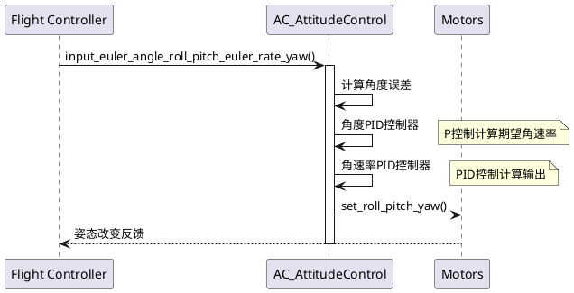
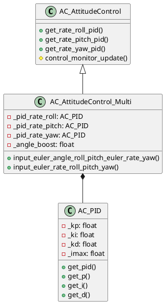
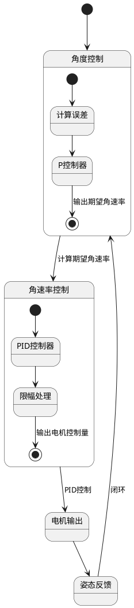

```plantuml
@startuml
participant "Flight Controller" as FC
participant "AC_AttitudeControl" as AC
participant "Motors" as Motors

FC -> AC: input_euler_angle_roll_pitch_euler_rate_yaw()
activate AC

AC -> AC: 计算角度误差
AC -> AC: 角度PID控制器
note right: P控制计算期望角速率

AC -> AC: 角速率PID控制器
note right: PID控制计算输出
AC -> Motors: set_roll_pitch_yaw()

Motors --> FC: 姿态改变反馈
deactivate AC
@enduml
```
类图

```plantuml
@startuml
class AC_AttitudeControl {
  +get_rate_roll_pid()
  +get_rate_pitch_pid()
  +get_rate_yaw_pid()
  #control_monitor_update()
}

class AC_AttitudeControl_Multi {
  -_pid_rate_roll: AC_PID
  -_pid_rate_pitch: AC_PID  
  -_pid_rate_yaw: AC_PID
  -_angle_boost: float
  +input_euler_angle_roll_pitch_euler_rate_yaw()
  +input_euler_rate_roll_pitch_yaw() 
}

class AC_PID {
  -_kp: float
  -_ki: float 
  -_kd: float
  -_imax: float
  +get_pid()
  +get_p()
  +get_i()
  +get_d()
}

AC_AttitudeControl <|-- AC_AttitudeControl_Multi
AC_AttitudeControl_Multi *-- AC_PID
@enduml
```

状态图

```plantuml
@startuml
[*] --> 角度控制
角度控制 --> 角速率控制: 计算期望角速率
角速率控制 --> 电机输出: PID控制
电机输出 --> 姿态反馈
姿态反馈 --> 角度控制: 闭环

state 角度控制 {
  [*] --> 计算误差
  计算误差 --> P控制器
  P控制器 --> [*]: 输出期望角速率
}

state 角速率控制 {
  [*] --> PID控制器
  PID控制器 --> 限幅处理
  限幅处理 --> [*]: 输出电机控制量
}
@enduml
```
