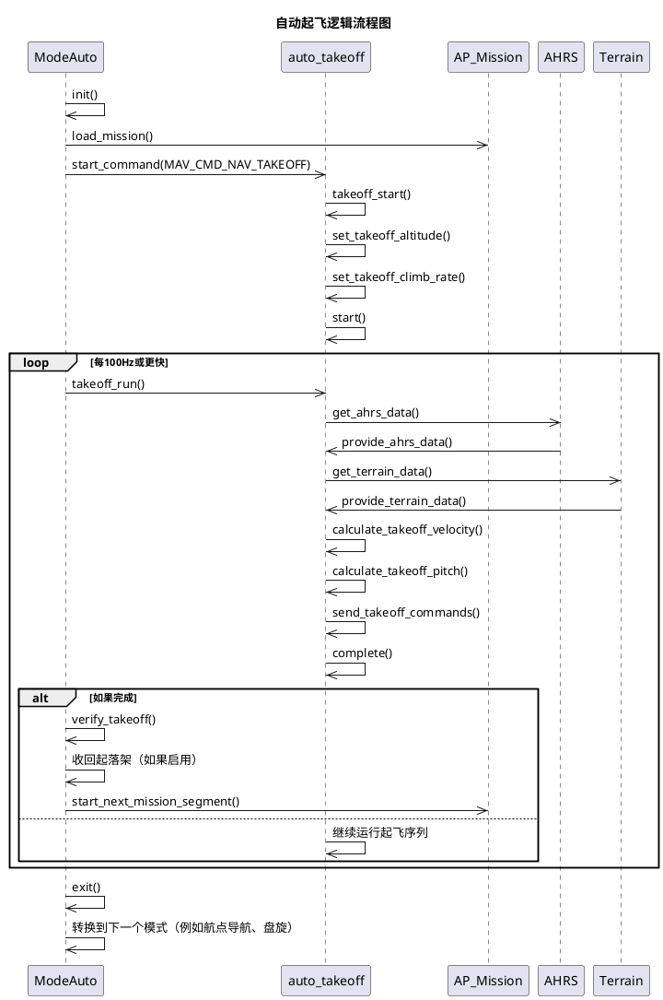

```plantuml
@startuml
title 自动起飞逻辑流程图

participant "ModeAuto" as MA
participant "auto_takeoff" as AT
participant "AP_Mission" as AM
participant "AHRS" as AH
participant "Terrain" as TR

MA ->> MA: init()
MA ->> AM: load_mission()
MA ->> AT: start_command(MAV_CMD_NAV_TAKEOFF)
AT ->> AT: takeoff_start()
AT ->> AT: set_takeoff_altitude()
AT ->> AT: set_takeoff_climb_rate()
AT ->> AT: start()

loop 每100Hz或更快
  MA ->> AT: takeoff_run()
  AT ->> AH: get_ahrs_data()
  AH ->> AT: provide_ahrs_data()
  AT ->> TR: get_terrain_data()
  TR ->> AT: provide_terrain_data()
  AT ->> AT: calculate_takeoff_velocity()
  AT ->> AT: calculate_takeoff_pitch()
  AT ->> AT: send_takeoff_commands()
  AT ->> AT: complete()
  alt 如果完成
    MA ->> MA: verify_takeoff()
    MA ->> MA: 收回起落架（如果启用）
    MA ->> AM: start_next_mission_segment()
  else
    AT ->> AT: 继续运行起飞序列
  end
end

MA ->> MA: exit()
MA ->> MA: 转换到下一个模式（例如航点导航、盘旋）

@enduml
```