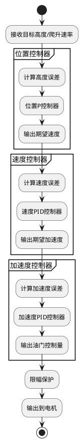
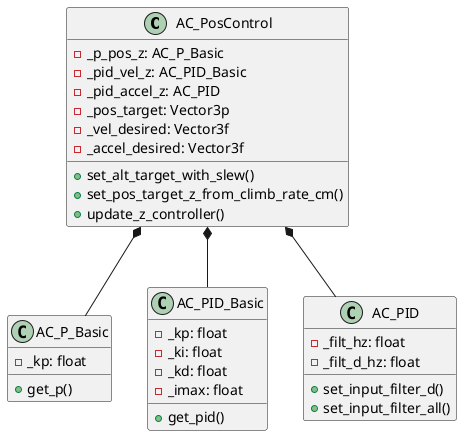
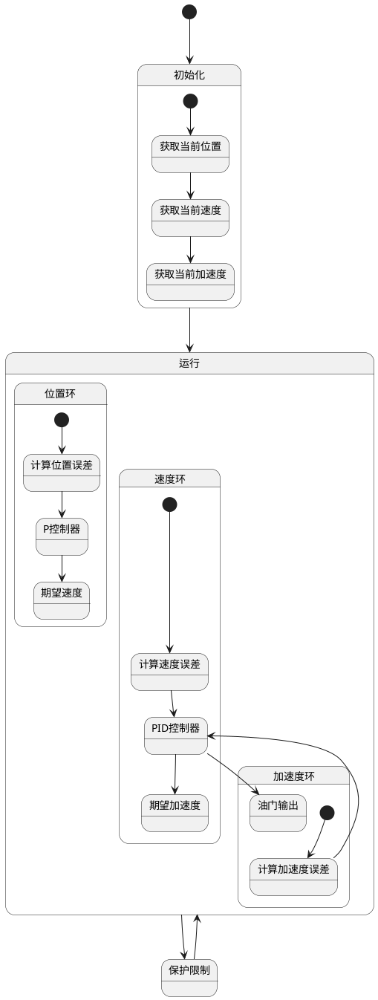

```plantuml
@startuml
start
:接收目标高度/爬升速率;

partition "位置控制器" {
  :计算高度误差;
  :位置P控制器;
  :输出期望速度;
}

partition "速度控制器" {
  :计算速度误差;
  :速度PID控制器;
  :输出期望加速度;
}

partition "加速度控制器" {
  :计算加速度误差;
  :加速度PID控制器;
  :输出油门控制量;
}

:限幅保护;
:输出到电机;

stop
@enduml
```

类图

```plantuml
@startuml
class AC_PosControl {
  -_p_pos_z: AC_P_Basic
  -_pid_vel_z: AC_PID_Basic
  -_pid_accel_z: AC_PID
  -_pos_target: Vector3p
  -_vel_desired: Vector3f
  -_accel_desired: Vector3f
  +set_alt_target_with_slew()
  +set_pos_target_z_from_climb_rate_cm()
  +update_z_controller()
}

class AC_P_Basic {
  -_kp: float
  +get_p()
}

class AC_PID_Basic {
  -_kp: float
  -_ki: float
  -_kd: float
  -_imax: float
  +get_pid()
}

class AC_PID {
  -_filt_hz: float
  -_filt_d_hz: float
  +set_input_filter_d()
  +set_input_filter_all()
}

AC_PosControl *-- AC_P_Basic
AC_PosControl *-- AC_PID_Basic
AC_PosControl *-- AC_PID
@enduml
```

状态图

```plantuml
@startuml
[*] --> 初始化

state 初始化 {
  [*] --> 获取当前位置
  获取当前位置 --> 获取当前速度
  获取当前速度 --> 获取当前加速度
}

初始化 --> 运行

state 运行 {
  state 位置环 {
    [*] --> 计算位置误差
    计算位置误差 --> P控制器
    P控制器 --> 期望速度
  }
  
  state 速度环 {
    [*] --> 计算速度误差
    计算速度误差 --> PID控制器
    PID控制器 --> 期望加速度
  }
  
  state 加速度环 {
    [*] --> 计算加速度误差
    计算加速度误差 --> PID控制器
    PID控制器 --> 油门输出
  }
}

运行 --> 保护限制
保护限制 --> 运行

@enduml
```