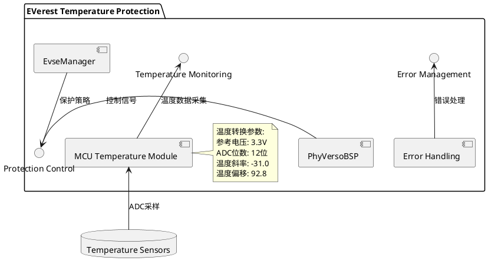
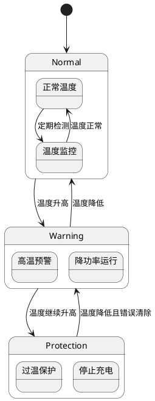
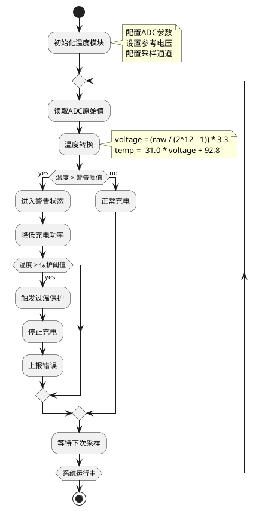

```plantuml
@startuml
skinparam componentStyle uml2

package "EVerest Temperature Protection" {
  [EvseManager] as evse
  [PhyVersoBSP] as bsp
  [MCU Temperature Module] as temp
  [Error Handling] as error

  interface "Temperature Monitoring" as tm
  interface "Protection Control" as pc
  interface "Error Management" as em

  temp -up-> tm : 温度数据采集
  bsp -right-> pc : 控制信号
  evse -down-> pc : 保护策略
  error -up-> em : 错误处理

  note right of temp
    温度转换参数:
    参考电压: 3.3V
    ADC位数: 12位
    温度斜率: -31.0
    温度偏移: 92.8
  end note
}

database "Temperature Sensors" as sensors
sensors -up-> temp : ADC采样

@enduml
```

```plantuml
@startuml
[*] --> Normal

state Normal {
  state "正常温度" as NormalTemp
  state "温度监控" as Monitoring
  NormalTemp --> Monitoring : 定期检测
  Monitoring --> NormalTemp : 温度正常
}

state Warning {
  state "高温预警" as HighTemp
  state "降功率运行" as Derating
}

state Protection {
  state "过温保护" as OverTemp
  state "停止充电" as StopCharging
}

Normal --> Warning : 温度升高
Warning --> Normal : 温度降低
Warning --> Protection : 温度继续升高
Protection --> Warning : 温度降低且错误清除

@enduml
```

```plantuml
@startuml
start

:初始化温度模块;
note right
  配置ADC参数
  设置参考电压
  配置采样通道
end note

repeat
  :读取ADC原始值;
  :温度转换;
  note right
    voltage = (raw / (2^12 - 1)) * 3.3
    temp = -31.0 * voltage + 92.8
  end note
  
  if (温度 > 警告阈值) then (yes)
    :进入警告状态;
    :降低充电功率;
    if (温度 > 保护阈值) then (yes)
      :触发过温保护;
      :停止充电;
      :上报错误;
    endif
  else (no)
    :正常充电;
  endif
  
  :等待下次采样;
repeat while (系统运行中)

stop
@enduml
```