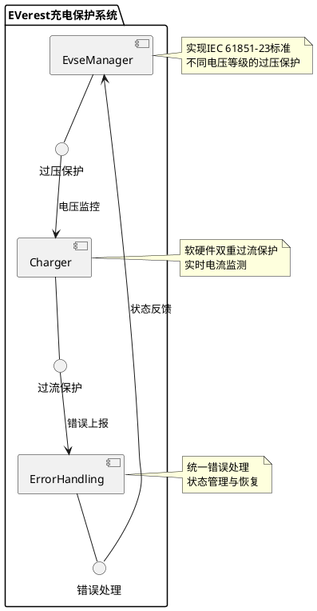

```d2
# 过充保护架构图
direction: right

classes: {
  component: {
    style: {
      fill: "#f5f5f5"
      stroke: "#2B2B2B"
      border-radius: 4
      shadow: true
    }
  }
  flow: {
    style: {
      stroke: "#2B2B2B"
      opacity: 0.7
      stroke-dash: 3 
    }
  }
}

EvseManager: {
  class: component
  
  shape: rectangle
  style.multiple: true
  
  过压保护: {
    获取阈值
    监控电压
    触发保护
  }
}

Charger: {
  class: component
  
  shape: rectangle
  style.multiple: true
  
  过流保护: {
    软件限流
    硬件限流
    错误处理
  }
}

ErrorHandling: {
  class: component
  
  shape: rectangle
  style.multiple: true
  
  错误管理: {
    错误触发
    错误清除
    状态恢复
  }
}

EvseManager -> Charger: 电压/电流监控
Charger -> ErrorHandling: 错误上报
ErrorHandling -> EvseManager: 状态反馈

# 过压保护流程图
direction: down

start: 开始充电 {
  shape: circle
}

voltage_check: 电压检测 {
  shape: diamond
}

threshold: 获取过压阈值 {
  shape: rectangle
  style.fill: "#e1f5fe"
}

protection: 触发过压保护 {
  shape: rectangle 
  style.fill: "#ffebee"
}

error: 错误处理 {
  shape: rectangle
  style.fill: "#fff3e0" 
}

resume: 恢复充电 {
  shape: rectangle
  style.fill: "#e8f5e9"
}

end: 结束 {
  shape: circle
}

start -> voltage_check
voltage_check -> threshold: 电压超过阈值
threshold -> protection: 确认过压
protection -> error: 触发错误
error -> resume: 错误清除
resume -> end
voltage_check -> end: 电压正常

# 过流保护流程图 
direction: down

start2: 开始充电 {
  shape: circle
}

current_monitor: 电流监测 {
  shape: diamond
}

soft_limit: 软件限流 {
  shape: rectangle
  style.fill: "#e1f5fe"
}

hard_limit: 硬件限流 {
  shape: rectangle
  style.fill: "#ffebee"
}

error2: 错误处理 {
  shape: rectangle
  style.fill: "#fff3e0"
}

resume2: 恢复充电 {
  shape: rectangle
  style.fill: "#e8f5e9"
}

end2: 结束 {
  shape: circle
}

start2 -> current_monitor
current_monitor -> soft_limit: 超过软件阈值
soft_limit -> hard_limit: 超过硬件阈值
hard_limit -> error2: 触发错误
error2 -> resume2: 错误清除
resume2 -> end2
current_monitor -> end2: 电流正常
```


